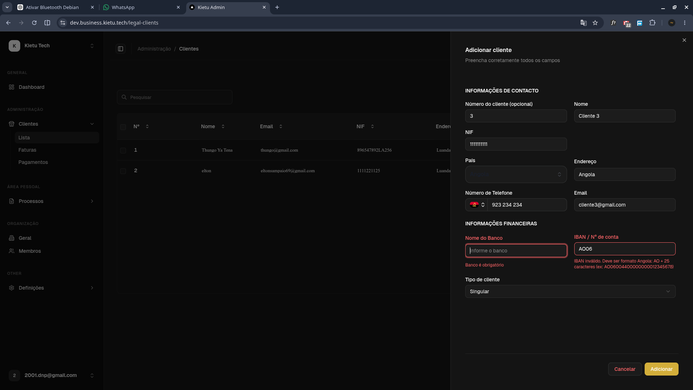
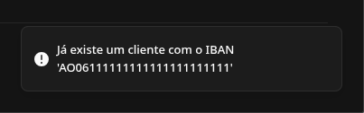
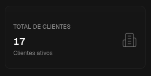
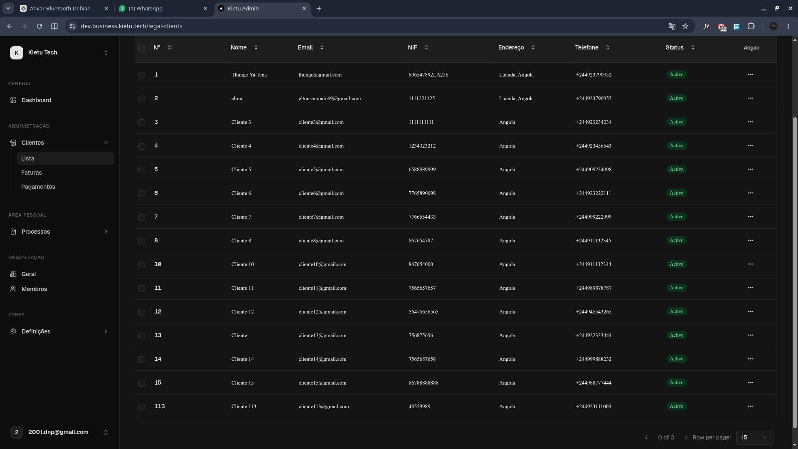
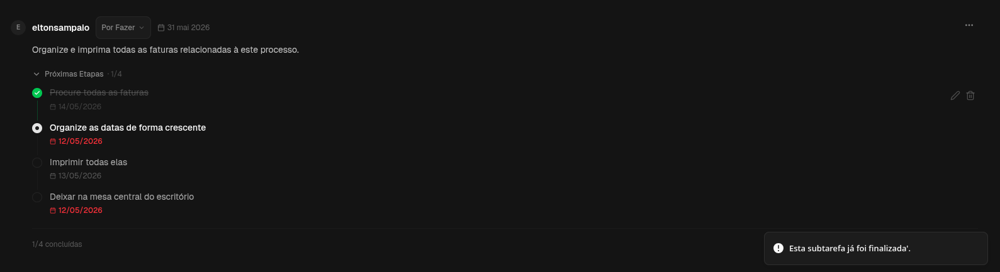
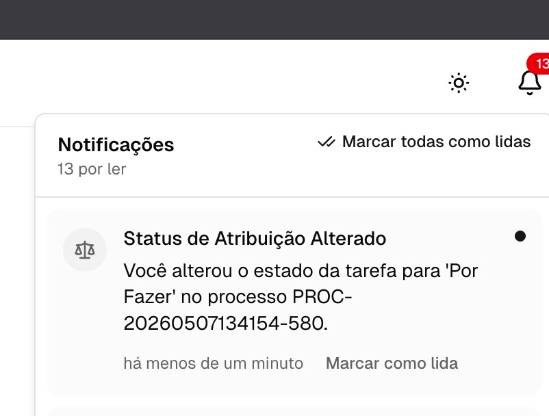
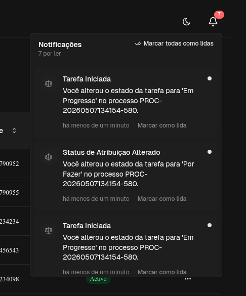

# 🐞 Erros Encontrados

---

## 1. Validação obrigatória de dados bancários no ambiente dev

No ambiente de desenvolvimento, a criação de um cliente ainda exige a inserção obrigatória dos seus dados bancários, mesmo em cenários onde isso não deveria ser necessário.

  

---

## 2. Bloqueio de IBAN duplicado

No ambiente dev, não é permitido registar o mesmo IBAN mais de uma vez, o que pode limitar testes de cenários repetidos.

  

---

## 3. Inconsistência entre frontend e backend ao registar cliente

Em determinado momento, ao inserir um cliente, o frontend apresentou a mensagem:

> “Não foi possível executar a operação, ou houve uma falha.”

No entanto, ao tentar registar novamente com os mesmos dados, o sistema informou que o cliente já existia.

Ou seja, o frontend indicou erro na operação, mas o backend executou o registo com sucesso.

---

## 4. Paginação não funcional nas listas

Os botões **ANTERIOR** e **SEGUINTE** nas listas de clientes e membros (e possivelmente outras listas) não estão funcionais.

Exemplo:
- Existem 17 funcionários
- A lista mostra apenas 15 por página
- Os botões de navegação deveriam estar ativos para permitir ver os restantes 2 registos

  

  

---

## 5. Subtarefa não desmarca no frontend

Uma subtarefa, após ser marcada como concluída, não é possível desmarcá-la no frontend, indicando possível problema de estado ou sincronização.

  

## 6. Notificações em Diferentes Edge Cases de Alteração de Tarefas

Temos aqui diferentes edge cases: se eu alterar a minha tarefa, não preciso de ser notificado, porque fui eu quem a alterou. Agora, se eu alterar a tarefa do Domingos, faz sentido notificar o Domingos, mas com uma mensagem diferente, por exemplo: “O utilizador X alterou a sua tarefa de X para Y.”

---

  

  

# 📌 Observação

Todos os problemas acima foram observados no ambiente de desenvolvimento e podem estar relacionados a:
- validações excessivas no frontend
- inconsistência entre frontend e backend
- problemas de estado (state management)
- paginação incompleta ou desativada

---